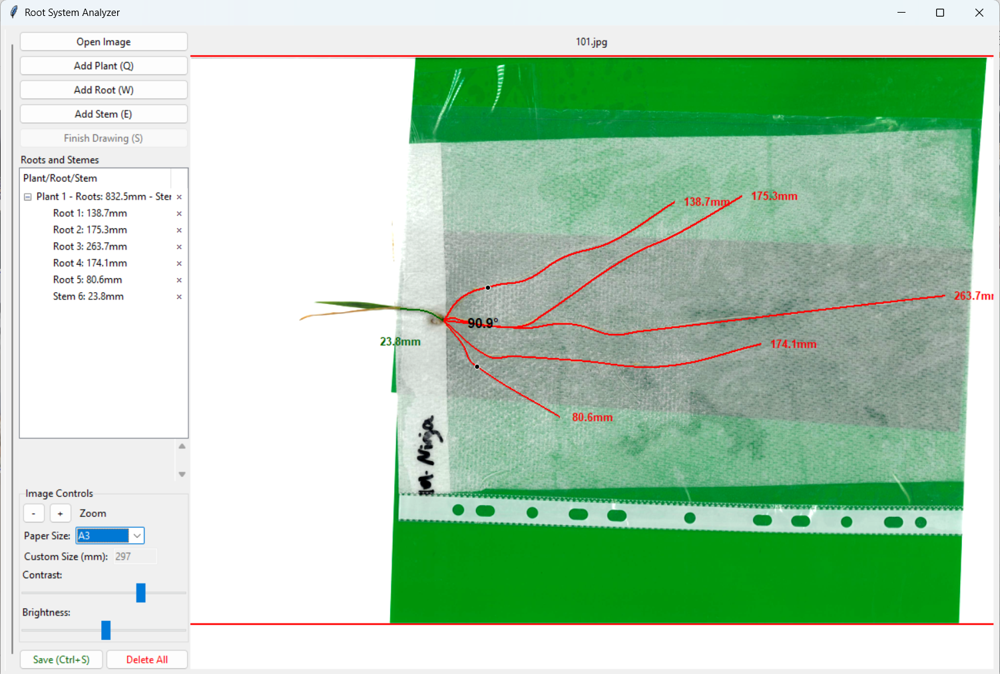

# Root System Analyzer

**An open-source, educational GUI tool for manually tracing and measuring plant root systems from images.**

Developed for educational and research purposes at [The University of Queensland](https://www.uq.edu.au/). This tool is freely available for students, educators, and researchers who need a simple, hands-on way to measure root architecture from scanned or photographed root images — no image-analysis expertise required.

## License

This project is licensed under the [MIT License](LICENSE) — Copyright (c) 2026 Yeming.

You are free to use, modify, and distribute it for any purpose, provided the original copyright notice is retained.

---

## What Does This App Do?

When you have photos or scans of plant roots (e.g., roots laid on paper), this tool lets you:

1. **Load an image** of a root system.
2. **Manually trace** roots and stems by clicking points on the image to draw curves over them.
3. **Automatically calculate** the length (in mm) and angles of the traced roots/stems, using a known paper size (A3/A4) as the scale reference.
4. **Export measurements** to a CSV file for further analysis in Excel, R, or Python.
5. **Batch-generate annotated images** (overlays) from saved JSON measurement files using `batch_overlay_generator.py`.

This is particularly useful in plant science education and phenotyping research where automated root detection software is unavailable or too complex.



---

## Installation

### Step 1 — Install Python

Download and install **Python 3.8 or higher** from [python.org](https://www.python.org/downloads/).

> During installation on Windows, check **"Add Python to PATH"**.

Verify the installation:

```bash
python --version
```

### Step 2 — Download the App

Clone the repository or download it as a ZIP:

```bash
git clone https://github.com/your-org/root-system-analyzer.git
cd root-system-analyzer
```

Or click **Code → Download ZIP** on GitHub, then extract the folder.

### Step 3 — Install Dependencies

```bash
pip install -r requirements.txt
```

This installs:

- [Pillow](https://python-pillow.org/) >= 10.0.0 — image loading and processing
- [NumPy](https://numpy.org/) >= 1.24.0 — curve calculations

### Step 4 — Run the App

```bash
python root_analyzer.py
```

The GUI window will open and you are ready to start measuring.

---

## Requirements

- Python 3.8 or higher
- [Pillow](https://python-pillow.org/) >= 10.0.0
- [NumPy](https://numpy.org/) >= 1.24.0

---

## How to Use

### 1. Launch the App

```bash
python root_analyzer.py
```

### 2. Load an Image

- Click **"Open Image"** and select a root image (PNG, JPG, JPEG, BMP, or GIF).
- Use the **contrast/brightness** sliders to enhance visibility if needed.
- Use **zoom** controls or scroll to zoom in on fine root details.

### 3. Set the Scale

Before measuring, tell the app what physical size the image represents:

- Select the paper size the roots were photographed on: **A4** (210 mm wide), **A3** (297 mm wide), or **Custom**.
- All measurements will be automatically converted to **millimeters**.
- If you select **"Output pixels"**, raw pixel counts are reported instead.

### 4. Trace Roots and Stems

Each plant is traced independently:

1. Press `Q` or click **"Add Plant"** to create a new plant entry.
2. Press `W` or click **"Add Root"** to start tracing a root.
   - Or press `E` / click **"Add Stem"** to trace a stem.
3. **Click on the image** to place points along the root/stem:
   - 1st click → start point
   - 2nd click → end point
   - Additional clicks → control points that bend the curve
4. Press `S` or click **"Finish Drawing"** when done with that root/stem.
5. Repeat for each root and stem on the plant.

> **Note:** From the second root/stem onward on the same plant, the **start point is automatically set to the start point of the first root**, regardless of where you click. This ensures all roots for a plant share a common origin.

> Tip: Roots are drawn in plant-specific colours. Stems are drawn in dark green. You can trace up to 10 plants per image with distinct colours.

### 5. Save and Export

- Press `Ctrl+S` or click **"Save"** to export all measurements.
- A **CSV file** is saved alongside the image with all length and angle data.
- A **`label data/` folder** is created in the same directory as the image, containing:
  - A **JSON backup** (`.json`) so you can reload or regenerate annotated images later.
  - A **labeled PNG** (`_label.png`) with the traced curves drawn on a transparent background.

### 6. Navigate Multiple Images

- Press `←` / `→` arrow keys or use the navigation buttons to move between images in a folder.
- Data is saved automatically as you navigate.

---

## Keyboard Shortcuts

| Key | Action |
|-----|--------|
| `Q` | Add new plant |
| `W` | Start drawing root |
| `E` | Start drawing stem |
| `S` | Finish current drawing |
| `Ctrl+Z` | Undo last point |
| `Ctrl+Shift+Z` | Redo last point |
| `Ctrl+S` | Save all data |
| `←` | Previous image |
| `→` | Next image |
| `Esc` | Cancel current drawing |

---

## Output Files

When you save, three files are written:

```
<image_directory>/
├── <image_name>.csv          ← saved alongside the image
└── label data/
    ├── <image_name>.json     ← JSON backup
    └── <image_name>_label.png ← labeled overlay PNG
```

### CSV (`<image_name>.csv`)

Saved in the **same folder as the image**. One row per traced root/stem/angle measurement:

| Column | Description |
|--------|-------------|
| `Image` | Source image filename |
| `Plant` | Plant identifier (e.g., Plant 1) |
| `Type` | `root`, `stem`, or `angle` |
| `Measure` | Length in mm, or angle in degrees |

### JSON Backup (`label data/<image_name>.json`)

Saved inside the **`label data/`** subfolder. A full backup of all curve points and plant labels. Used by `batch_overlay_generator.py` to regenerate annotated images.

### Labeled PNG (`label data/<image_name>_label.png`)

Saved inside the **`label data/`** subfolder. A transparent-background PNG with all traced curves drawn at original image resolution (roots in black, stems in dark green).

---

## Batch Overlay Generation

After measuring a set of images, you can regenerate annotated overlay images (with traced curves drawn on top) using:

```bash
python batch_overlay_generator.py
```

Edit the `folders` list inside the script to point to your image directories. For each `.json` backup file found, it produces a `<name>_ann.png` annotated image in the same folder.

---

## Intended Use

This tool was developed for **educational and research purposes** in plant science. It is intended to:

- Teach students how to characterise root architecture manually.
- Support small-scale phenotyping studies where automated tools are impractical.
- Provide a transparent, auditable measurement workflow with visual overlays.

Contributions and improvements are welcome.

